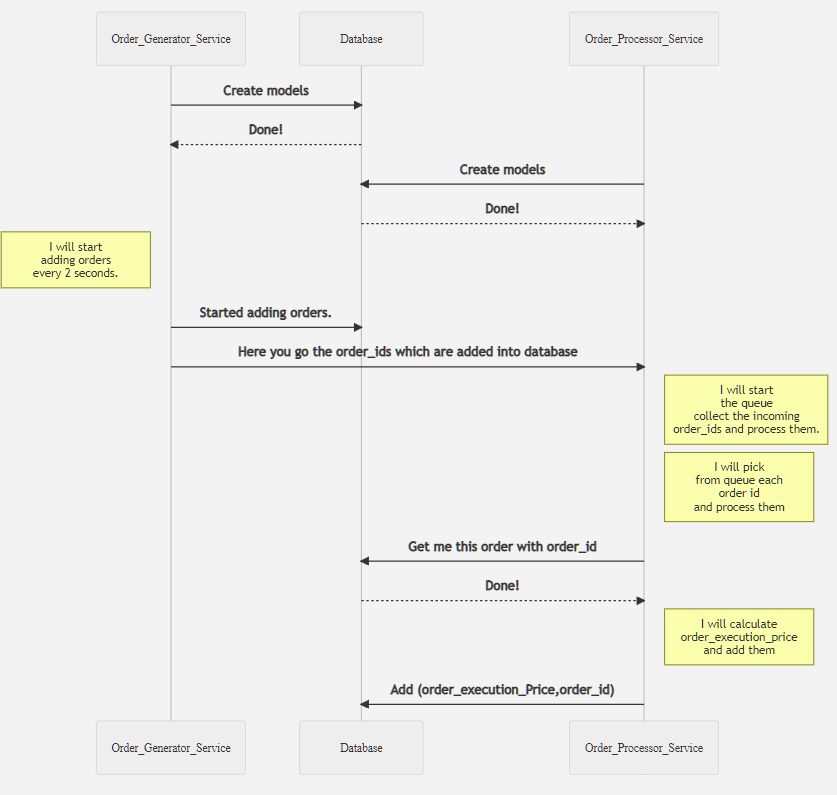

# Microservices Task
This is a order processing task. There are two micro services, one to push the orders into the database and the other is responsible to collect that order and process and perform calculations on them. These microservice internally communicate through RabbitMQ.

## Project Architecture
 

There are two microservices which will communicate with each other and process orders and calculate an OrderExecutionPrice. The order_generatore_service microservice is the one which generates orders every 2 seconds and update it in the database. It also publishes the order_id into the queue for further process. The second microservices will collect the published order_id from the queue and verify it with the database to check whether the order_exists. Once the confirmation is recieved it further calculates the order execution price. Once the order execution price is calculated it outputs the execution price to the standard output and further adds it to the database. If we want to calculate the total orders processed and the average execution price it can be easily calculated by taking the average of all from the database.

## Project Structure
The Python Flask based microservices project is composed of the following: 
* [Database](#Database)
* [Order-generator-service](#Order-generator-service)
* [Order-processor-service](#Order-processor-service)

## Database
The database used is MySql, which contains two tables, Orders table is used to store the order_ids with its quantity and order_process is used to store order_ids(FK) and its OrderExecutionPrice.

## Order-generator-service
This service is used to generate orders every two seconds. 

## Order-processor-service
This services communicates with the order-generator-service and gets the newly added order_id and quantity and processes the OrderExecutionPrice and stores it in a seperate table.

## Communication Protocol
The two microservices are communicating via RABBITMQ message broker service. Inorder to get RabbitMq messae broker as a service CloudAMQP is used. 
> The communication protocol used creates an external dependency, which could have been solved by normal JSON requests too. This has been done just to demonstrate the whole project.

## Source Code Structure
```
Microservices-OrderProcessor
	
	|-- database                    	# database as service
	
	|-- images                      	# images of architecture and screenshots of results
	
	|-- order_generator_service     	# Generates orders every two seconds(First microservice)
		|-- application            
			|-- OrderGeneratorApi 		
				|-- producer.py     	# Message broker, publishes order_ids to second service
				|-- routes.py			# Containes Application logic with routes
			|-- models.py         		# Database models of application
		|-- Dockerfile                  # Configure the whole service as container
		|-- config.py                   # Flask Application config file
		|-- docker-compose.yml          # Docker compose file
		|-- requirements.txt            # Packages needed for the application
		|-- run.py                      # Main file which serves as a starting point for the service
		
	|-- order_processor_service      	# Processes every order (second microservice)
		|-- application            
			|-- OrderProcessorApi 		
				|-- api
					|-- OrderInfo.py    # Api calls config
				|-- routes.py           # Custom routes which containes application logic
			|-- models.py         		# Database models
		|-- Dockerfile					# Configure the whole service as container
		|-- consumer.py					# Message Broker to collect order_ids and process them
		|-- consumer_dockerfile         # Docker file for consumer
		|-- config.py					# Flask application config
		|-- docker-compose.yml			# Docker compose file
		|-- requirements.txt			# Packages needed for the application
		|-- run.py           			# Main file which serves as a starting point for the service
```
## Microservices Setup and Configuration
To launch the end-to-end microservices application perform the following:

### Step 1.
Create a new Docker network and name it ```micro_network```:
```
docker network create micro_network
```
### Step 2.
Set up network
```
docker network create micro_network
```
#### order_generator_service
```
cd order_generator_service
docker-compose up --build
```

#### order_processor_service
```
cd order_processor_service
docker-compose up --build
```

#### database
```
cd database
docker-compose up --build
```
### Step 3.
Create database tables for order_generator_service
```
docker-compose exec generate_orders_service flask shell
```


Opens up a shell, please enter the following below.
```
>>> from application.models import Orders
>>> from application import db
>>> db.create_all()
>>> exit()
```

Create database tables for order_processor_service
```
docker-compose exec order_processor_service sh
```
Opens up a shell, please enter the following below.
```
>>> from application.models import order_process
>>> from application import db
>>> db.create_all()
>>> exit()
```
The creation of database via models is a manual process and has been kept that way intentionally, so as to avoid any problems.

### Step 4.
Using browser you can now start the process by accessing the links
```
http://localhost:5000/
```
You can see in the standard out of the order_processor_service container the "OrderExecutionPrice" is getting printed
and also in the "order_generator_service" container the order_id getting printed.

You can access the average execution price and total orders processed information using the below link
```
localhost:5001/metrics
```
You can also stop processing all of the orders by accessing the below link
```
http://localhost:5000/stop_order
```
Please note, once the above link is executed the scheduler is killed. In order to restart the scheduler, you need to restart your containers from the beginning and start the whole process all over again. 

There is no restart functionality which has been added purposefully.

## Running Tests
#### Step 1.
Please go to the folder tests and create a virtual environment.
```
cd test
python -m venv <name of virtual environment>
```
#### Step 2.
Activate the virtual environment
Windows:
```
<name of virtual environment>/Scripts/activate
```
Linux:
```
<name of virtual environment>/bin/activate
```
#### Step 3.
Install all of the requirements
```
pip install -r requirements.txt
```
#### Step 4.
You can run all of your tests using the command below
```
cd integartion
python -m unittest test_integration
```
This will run all of the basic integartion tests defined. 

> Please note TRUNCATE command is called on the same database when running tests, this is not a good practise but has been
done just for experimental purposes. Although this would not be an ideal situation in the real scenario.


## Docker Commands:

List all running containers
```
docker ps
```

#### List all containers
```
docker ps -a
```

#### Shell into container
```
docker-compose exec <container name> -i -t sh
```

#### Kill all running containers
```
docker kill $(docker ps -q)
```
#### Stop all running containers
```
docker stop $(docker ps -a -q) 
```

#### Stop specific containers
```
docker stop <container name> 
```

#### Delete all stopped containers
```
docker rm $(docker ps -a -q)
```

#### Delete specific containers
```
docker rm <container name> 
```

#### Delete all images
```
docker rmi $(docker images -q)
```
